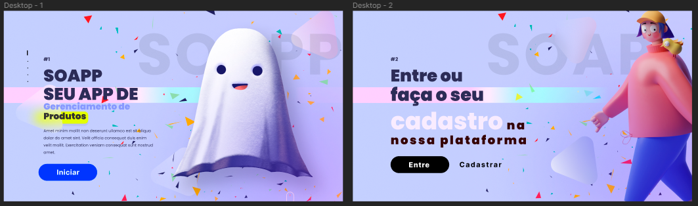
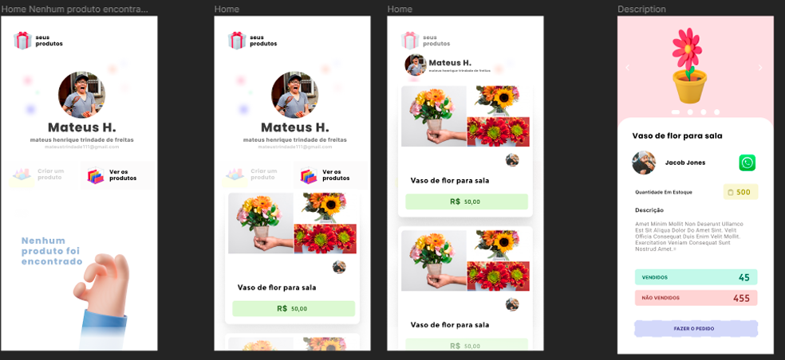
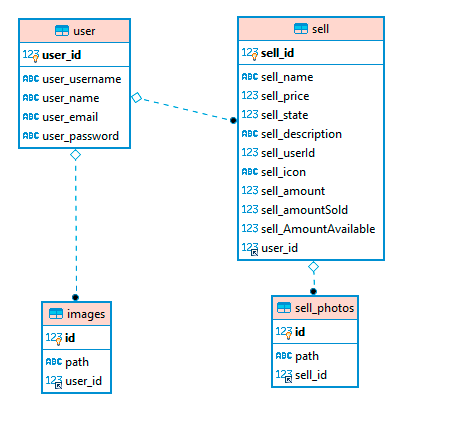

# Backend_Soap
Servidor/banco de dados criado para um projeto pessoal.

# <h3> Sobre o projeto </h3>
O Soapp é um projeto pessoal feito para gerenciar estoques de produtos. Atuei como desenvolvedor backend do projeto utilizando Node, TypeORM e MySQL.

# Minha função no projeto

O projeto conta apenas com 2 lados, os 'users' e os 'sells' (vendas/produtos), onde o cada usuario gerencia seus proprios e produtos. Cada usuario pode ter suas fotos, e cada 'sell' pode ter varias fotos do produto. 

Existe rotas de CRUD para a tabela 'users' e 'sells'.

# <h3> Teste com o IMSONIA! </h3>
Na raíz do projeto, existe um arquivo 'imsonia.json', basta importa ele para um workspace no inmsonimia e testar voce mesmo!
# <h3> Requisitos <h3>
 
1. 📦<i> MySQL<i>
2. 📦<i> XAMPP<i>
3. 📦<i> NPM ou YARN<i>

# <h3> Rodar aplicação <h3>
 
 1. 🔥 npm install
 2. 🔥 npm dev
